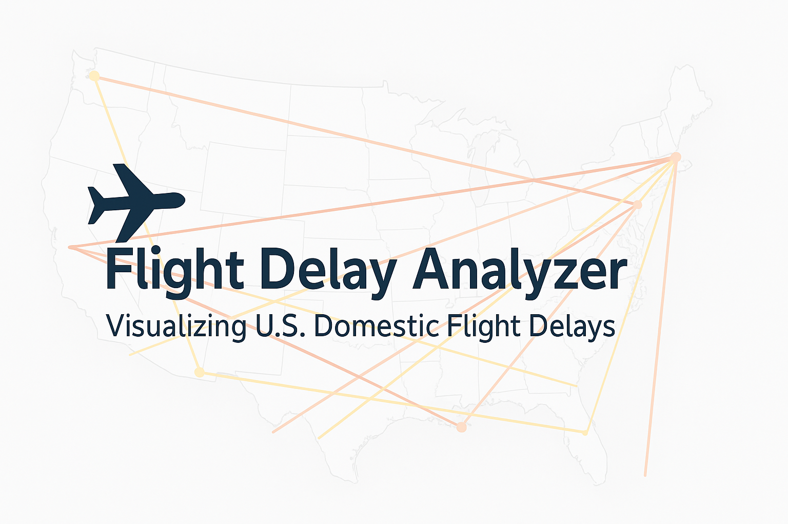

# ✈️ Flight Delay Analyzer

Analyze and visualize US domestic flight delays across the USA using SQL, Python, and interactive maps.

---

## 🛠 Project Description

This project connects to a SQLite database containing real domestic flight data across the USA.  
It allows users to:

- Search for flights by ID
- View all flights on a specific date
- Analyze delays by airline or airport
- Visualize flight delay patterns using bar charts, heatmaps, and interactive maps

Built with:
- Python
- SQLite (SQLAlchemy)
- Pandas
- Matplotlib
- Seaborn
- Folium (for interactive maps)

---

## 📊 Main Features

- **Flight Lookup**: Search for flights by ID or by departure date
- **Delay Reports**:
  - Delayed flights by airline
  - Delayed flights by airport
- **Graphs**:
  - Bar graph: Delayed flights per airline
  - Bar graph: Delayed flights by hour of the day
  - Heatmap: Percentage of delayed flights by route
  - Interactive map: Visualize heavily delayed routes across the USA

---

## 🚀 How to Run

1. Clone the repository:

   git clone https://github.com/yourusername/flight-delay-analyzer.git

2. Install dependencies:

   pip install sqlalchemy pandas matplotlib seaborn folium

3. Make sure the SQLite database flights.sqlite3 is available in the project folder.

4. Run the main program:

python main.py

## Project structure:

/ (root) │ ├── main.py ├── bar_graph.py ├── data.py (if needed) ├── flights.sqlite3 ├── README.md ├── USA delay_routes.png
## Future Improvements

Add delay severity icons to maps
Allow filtering by airline company or airport hub
Animate flights over the day (time-lapse mode)
Export reports to PDF

### License
This project is open source and free to use under the MIT License.
